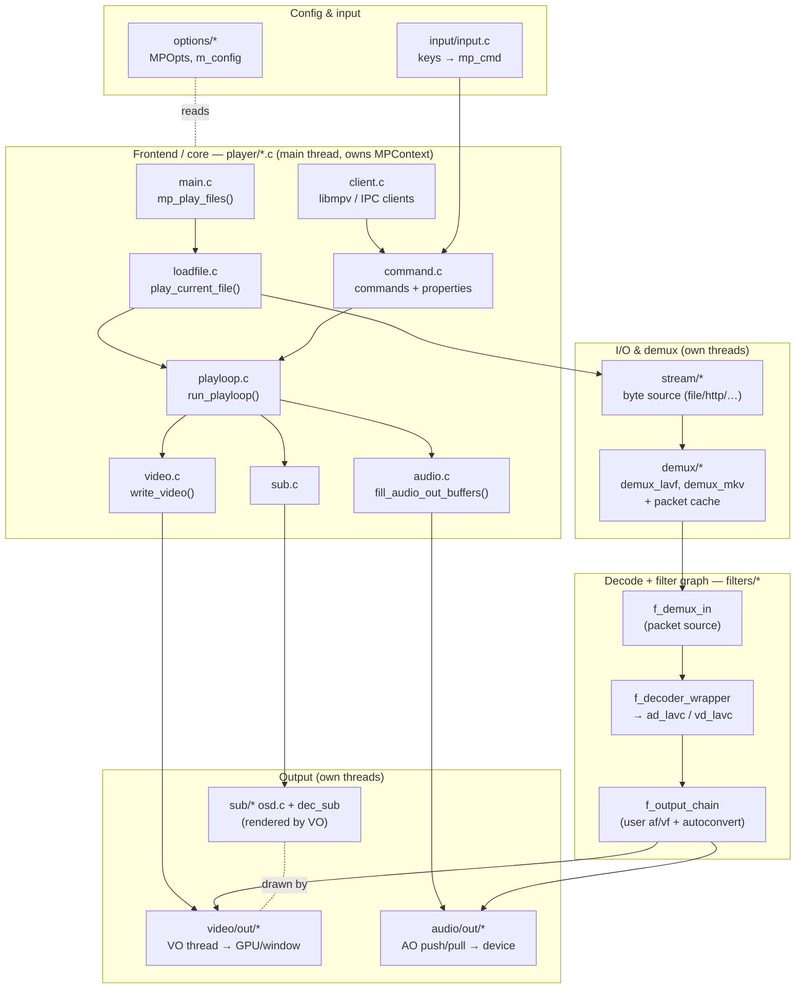

# mpv — High-Level Architecture

A map of mpv's main components and how they cooperate to turn a URL/file on the
command line into audio coming out of your speakers and video on your screen.

This complements [`DOCS/tech-overview.txt`](../../DOCS/tech-overview.txt) (the
per-directory reference) with a picture of the *runtime* flow and a sequence
diagram of loading + rendering.

---

## 1. The big picture

mpv is a **single-threaded frontend** ("the core", `player/*.c`, holding all
state in one big `struct MPContext`) that drives a set of **mostly
single-threaded subsystem APIs**, some of which internally run their own
threads (demuxer, VO, AO, streams). The core never lets subsystems call back
into it directly — instead they raise a **wakeup callback** that just re-runs
the playloop, which then *polls* each subsystem for new state. This keeps the
call graph a DAG (core calls "down"; nothing calls "up" except wakeups) and
sidesteps most locking/reentrancy problems.



---

## 2. Components at a glance

| Layer | Where | Responsibility |
|---|---|---|
| **Frontend / core** | `player/*.c`, state in `player/core.h` (`MPContext`) | `main()`, playlist, load/unload, the playback loop, A/V sync, seeking. Pushes data between subsystems; polls them. |
| **Options** | `options/*` | `MPOpts` + per-component sub-option structs. Parsed from CLI/config into a thread-safe `m_config`; components read a synced copy via `m_config_cache_alloc()` using only `mpv_global`. |
| **Input / commands** | `input/input.c`, `player/command.c` | Keys/IPC → `mp_cmd` → `run_command()`. Commands + **properties** are the same surface the client API uses. |
| **Client API** | `player/client.c` (+ `libmpv`, IPC, scripts) | Exposes commands/properties/events; an event ringbuffer per client. |
| **Stream** | `stream/*` | Raw byte source chosen by URL prefix (`stream_lavf.c` for http, file, etc.). Runs on the demuxer thread. |
| **Demux** | `demux/*` (`demux_lavf.c`, `demux_mkv.c`) | Split container into per-stream **packets** (`demux_packet`, tagged with PTS). Owns the seekable, prefetching **packet cache** and runs a **reader thread**. |
| **Filter graph** | `filters/*` | Generic pin-based graph. `f_demux_in` = packet source; `f_decoder_wrapper` wraps `ad_lavc`/`vd_lavc`; `f_output_chain` holds user filters + `f_autoconvert`, and feeds the VO/AO. |
| **Decoders** | `audio/decode/ad_lavc.c`, `video/decode/vd_lavc.c` | FFmpeg-backed packet → frame decode (`mp_aframe` / `mp_image`). |
| **Video output** | `video/out/*` | Own **VO thread**, window + GPU rendering (`vo_gpu_next`), timing/vsync, and drawing the OSD/subs. |
| **Audio output** | `audio/out/*` | Device output; `buffer.c` bridges push- and pull-style AO APIs. **Audio is the master clock** — video syncs to it. |
| **Subs / OSD** | `sub/*` | `dec_sub.c` + `sd_*.c` decode/render subtitles; `osd.c` + `osd_libass.c` composite OSD/subtitles into bitmaps the VO draws. |
| **Memory** | `ta/*`, `mpv_talloc.h` | Hierarchical allocator: freeing a parent frees children; aborts on OOM. Ownership backbone everywhere. |

---

## 3. Threading model

mpv "pretends to be single-threaded": most APIs are thread-unsafe by design and
isolated behind glue code. Threads are used **coarsely**:

- **Main / core thread** — runs `run_playloop()`, owns `MPContext`, decodes on
  demand, does A/V sync, handles input/commands.
- **Demuxer thread** — reads the stream and fills the packet cache ahead of
  playback (`demux_start_thread`).
- **VO thread** — receives queued frames (`vo_queue_frame`) and renders/pages
  them to the display on its own clock.
- **AO thread** (push AOs) — drains audio to the device.
- **Stream/network threads** as needed.

Coordination is via **wakeup callbacks** (unblock the core → it re-polls) and
`mp_dispatch_queue`, never by subsystems calling into the core. Shared state is
guarded by `mp_mutex` / `mp_cond` with a documented lock order (leaf locks stay
private to their `.c` file).

> The bundled **AI translator** (`player/ai_translate.c`) follows this pattern:
> a background worker thread produces subtitle lines; the core only *polls* it
> each playloop tick via a small API and never lets it call back in. See §7.

---

## 4. Data flow in one line

```
stream bytes ──▶ demuxer ──▶ packets (PTS) ──▶ decoder ──▶ raw frames
        ──▶ filter/output chain ──▶ VO (video) / AO (audio) ──▶ screen / speakers
                                        ▲
                              OSD + subtitles composited by the VO
```

The core does not "own" the pixels: it *pulls* a frame from the output chain
when it decides (based on the audio clock) that it's time, and hands it to the
VO thread to display at the right vsync.

---

## 5. Sequence: loading and rendering a media stream

The path from `mpv movie.mkv` to the first rendered frame, and then the steady
playback loop. (`ad_lavc`/`vd_lavc` are the FFmpeg decoders behind
`f_decoder_wrapper`.)

```mermaid
sequenceDiagram
    autonumber
    participant U as User / CLI
    participant Main as main.c
    participant Load as loadfile.c
    participant Stream as stream/*
    participant Demux as demux/* (thread)
    participant Chain as filters/* (decode+output chain)
    participant Loop as playloop.c
    participant AO as audio/out (thread)
    participant VO as video/out (thread)
    participant OSD as sub/osd

    U->>Main: mpv movie.mkv
    Main->>Main: init libs, parse config + CLI, build playlist
    Main->>Load: mp_play_files() → play_current_file()

    rect rgb(238,244,255)
    note over Load,Demux: Load phase (per file)
    Load->>Stream: demux_open_url() → open byte source (prefix-based)
    Stream-->>Demux: raw stream
    Demux->>Demux: probe container, expose streams
    Demux->>Demux: demux_start_thread() (prefetch packets into cache)
    Load->>Load: add_demuxer_tracks(): build MPContext.tracks[]
    Load->>Load: select default a/v/sub tracks
    Load->>Chain: reinit_video_chain() / reinit_audio_chain()
    Chain->>Chain: f_demux_in → f_decoder_wrapper(vd/ad_lavc) → f_output_chain
    Chain->>VO: init VO (window + GPU) 
    Chain->>AO: init AO (open device)
    Load->>Loop: enter while(!stop_play) run_playloop()
    end

    rect rgb(240,255,240)
    note over Loop,VO: Playback loop (repeats every "frame")
    Loop->>Chain: fill_audio_out_buffers(): pull decoded audio
    Chain->>Demux: request packets (blocks only if cache empty)
    Demux-->>Chain: audio packets → ad_lavc → mp_aframe
    Chain-->>AO: ao_write_data() (AO = master clock)
    Loop->>Chain: write_video(): pull next mp_image
    Chain->>Demux: request packets → vd_lavc → mp_image
    Loop->>Loop: sync video PTS to audio clock, decide show time
    Loop->>OSD: update_subtitles() / OSD → sub bitmaps
    Loop->>VO: vo_queue_frame(image + OSD) at target vsync
    VO-->>U: render to display (VO thread)
    AO-->>U: play samples (AO thread)
    Demux--)Loop: wakeup callback when new data ready → re-poll
    end

    U->>Loop: input/command (seek, pause, quit) via command.c
    Loop->>Demux: on seek: demux_seek(), flush chain, restart clocks
```

Notes on the loop:

- **Pull, not push.** `run_playloop()` decodes only as much as it needs, driven
  by the audio clock. Video frames are pulled and queued to the VO to be shown
  at the correct vsync; audio is written to the AO which actually paces
  playback.
- **Back-pressure & prefetch.** The demuxer thread fills a packet cache ahead of
  the playhead; decoders block only when the cache underruns (which surfaces as
  the "buffering"/`paused_for_cache` state).
- **Wakeups.** When a subsystem has new data or an event, it calls the core's
  wakeup callback, which just unblocks `mp_wait_events()` so the next
  `run_playloop()` iteration re-polls everything.
- **Seeks/pause** enter through `command.c`, mutate `MPContext`, and the loop
  reacts on its next iteration (flush caches, re-sync clocks, restart output).

---

## 6. Key data structures

- **`struct MPContext`** (`player/core.h`) — the whole player: playlist,
  `tracks[]`, current demuxer, ao/vo chains, clocks (`playback_pts`,
  `audio_status`/`video_status`), pause flags, OSD state. Not shared with
  subsystems.
- **`struct track`** — one selectable a/v/sub stream: its `demuxer`, sh header,
  and decoder wrapper (`track->dec`).
- **`struct demux_packet`** — a container packet tagged with PTS/DTS, flowing
  demux → decoder.
- **`mp_aframe` / `mp_image`** — decoded audio/video frames (the currency of the
  filter graph and outputs).
- **`struct mp_filter` + pins** (`filters/`) — the generic graph node; data
  flows between `mp_pin`s. `f_demux_in`, `f_decoder_wrapper`, `f_autoconvert`,
  `f_output_chain` are all filters.
- **`MPOpts` + `m_config`** (`options/`) — options; components read synced
  copies via `m_config_cache_alloc(global, &their_conf)`.

---

## 7. Where the AI translator fits (this fork's addition)

The lookahead AI translator is a good example of the "isolated worker + core
polls it" pattern:

- **Options** — an `ai_translate_conf` sub-option group registered in
  `options/options.c`, exposing `--ai-translate*` flags on `MPOpts.ai_opts`.
- **Worker** — `player/ai_translate.c` spawns a background thread that
  *independently* reopens the media with FFmpeg, decodes audio **ahead** of the
  playhead, sends windows to a speech-to-text server and a translation API, and
  stores pts-keyed subtitle lines behind a mutex.
- **Core integration** — `player/loadfile.c` creates/destroys the worker with
  the file; `player/playloop.c` (`handle_ai_translate()`) each tick reports the
  playhead, reads the translated line for the current PTS and shows it as an OSD
  external overlay, and gates playback (`paused_for_ai`, folded into
  `get_internal_paused()`) until translation is far enough ahead.

The worker never calls into `MPContext`; the core drives it entirely through the
small `ai_translate_*` API — mirroring how mpv treats the demuxer, VO, and AO.

---

## 8. Where to start reading

1. `player/main.c` → `player/loadfile.c` (`play_current_file`) → `player/playloop.c`
   (`run_playloop`) — the spine.
2. `player/audio.c` (`fill_audio_out_buffers`) and `player/video.c`
   (`write_video`) — how frames reach the outputs.
3. `filters/f_decoder_wrapper.c` + `filters/f_output_chain.c` — the decode/filter
   graph.
4. `demux/demux.h` and `demux/demux_lavf.c` — packets and the cache.
5. `video/out/vo.c` and `audio/out/ao.c` — the output threads.
6. `DOCS/tech-overview.txt` — the canonical per-directory reference and the
   design "best practices" (locking, wakeups, condition variables).
